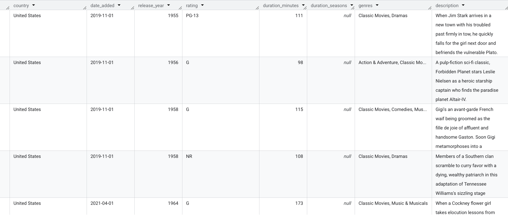
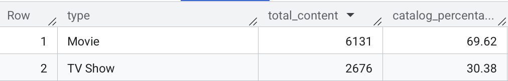
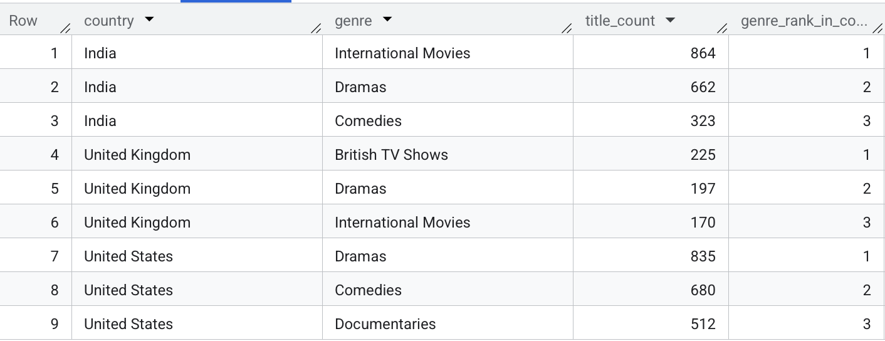
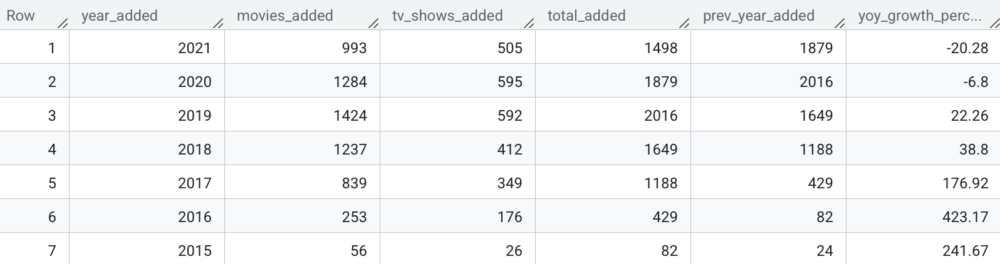

# 🎬 Netflix Movies & TV Shows: End-to-End Data Analysis (BigQuery & SQL)

[](https://cloud.google.com/bigquery)
[](#)
[](#)


<p align="center">
  
</p>


## 📌 Project Overview
This project performs an end-to-end data engineering and analytical review of the **Netflix Movies & TV Shows dataset** (sourced from Kaggle). Utilizing **Google BigQuery**, raw streaming data was cleaned, standardized, and analyzed to uncover operational catalog dynamics, audience profiling trends, regional production footprints, and licensing growth velocity.

---
## 🛠️ Tools & Technologies Used
* **Database / Engine:** Google BigQuery (SQL)
* **Dataset Source:** [Kaggle - Netflix Movies & TV Shows](https://www.kaggle.com/datasets/shivamb/netflix-shows)
* **SQL Techniques:** Window Functions (`ROW_NUMBER()`, `RANK()`), CTEs, Aggregations, String Manipulation (`SPLIT`, `UNNEST`, `TRIM`), Date/Time Handling, Data Type Casting.
* **Version Control:** Git & GitHub

---
## 📂 Dataset Overview
The dataset contains metadata for movies and TV shows added to Netflix up through 2021.

* **Total Records:** 8,807
* **Columns:** 12
* **Key Attributes:** `show_id`, `type`, `title`, `director`, `cast`, `country`, `date_added`, `release_year`, `rating`, `duration`, `listed_in` (genres), `description`.

> **⚠️ Limitations:** This dataset reflects Netflix's catalog composition **only up through 2021**. Findings on content strategy, genre concentration, and growth trends describe historical platform behavior and may not generalize to Netflix's current acquisition strategy or catalog.
---
## 📁 Repository Structure

```text
├── data/
│   └── netflix_titles.csv         # Raw CSV dataset from Kaggle
├── sql/
│   ├── 00_schemas.sql             # DDL
│   ├── 01_data_cleaning.sql       # Data transformations, null handling & type casting
│   ├── 02_eda_queries.sql         # 15 Core Business Problems
│   └── 03_business_insights.sql   # YoY growth, licensing lag, & regional concentration
├── outputs/                       # Exported query results (.csv files)
├── docs/                          # Snapshots of queries' results
└── README.md                      # Project documentation
```

---
## 📐 Database Schema & DDL (`00_schemas.sql`)

> **Architectural Note (BigQuery vs. PostgreSQL):**  
> While Google BigQuery offers schema auto-detection during CSV uploads, `00_schemas.sql` intentionally explicitly defines the database DDL. 

---
## 🧹 Data Cleaning & Transformation Workflow (`01_data_cleaning.sql`)

To transform the raw dataset into an analytics-ready table (`netflix_ds.cleaned_netflix_titles`), several data quality issues were systematically addressed in BigQuery:

* **Date Parsing:** Standardized mixed string date formats into BigQuery `DATE` objects (`YYYY-MM-DD`).
* **Null Handling:** Imputed missing values for categorical features (`director`, `cast`, `country`, `rating`) with `'Unknown'`.
* **Feature Extraction:** Split raw `duration` strings into numeric metrics (`duration_minutes` for Movies, `duration_seasons` for TV Shows).
* **Multi-Value Fields:** Array-handling prep (`UNNEST` + `SPLIT`) was embedded for composite fields like `country`, `cast`, and `listed_in` (genres).

### Before & After Transformation Summary

| Column Name | Raw Input (`raw_netflix_titles`) | Transformed Output (`cleaned_netflix_titles`) | SQL Technique / Logic Applied |
| :--- | :--- | :--- | :--- |
| **`director`** | `null` | `'Unknown'` | Imputed missing values using `COALESCE(director, 'Unknown')` |
| **`cast`** | `null` | `'Unknown'` | Imputed missing values using `COALESCE(cast, 'Unknown')` |
| **`country`** | `null` | `'Unknown'` | Imputed missing values using `COALESCE(country, 'Unknown')` |
| **`date_added`** | `"September 25, 2021"` | `2021-09-25` | Converted text strings to standard ISO `DATE` format using `PARSE_DATE()` & `TRIM()` |
| **`duration_minutes`**| `"90 min"` | `90` | Extracted numeric values into an `INT64` field using `SPLIT()`, `OFFSET()`, and `CAST()` |
| **`duration_seasons`**| `"2 Seasons"` | `2` | Isolated season count into an `INT64` field using `CASE WHEN` logic |
| **`genres`** | `listed_in` | `genres` | Renamed column for clearer dataset readability |



---
## 📊 Exploratory Data Analysis (`02_eda_queries.sql`)

The baseline exploratory analysis addresses **15 strategic business problems** organized into 4 operational pillars:

### Key Analytical Pillars
* **Catalog Composition:** Evaluated Movies vs. TV Shows split, maximum runtime outliers (longest movie), flagship series (>5 seasons), and metadata gaps (`director = 'Unknown'`).
* **Audience & Moderation:** Analyzed rating distributions using `RANK() OVER()`, mapped genre volume across exploded strings, and categorized sensitive content keywords (`kill`, `violence`).
* **Regional Footprints & Talent:** Identified top content-producing countries, tracked director output (*Rajiv Chilaka*), evaluated US peak release years, and analyzed star-power longevity (*Adam Sandler*).
* **Recency & Timeline:** Audited specific release vintages (2020) and tracked platform acquisition velocity over the last 5 years.

### 💡 Featured Query: Exploding Delimited Fields (`UNNEST` + `SPLIT`)
Handling composite multi-value fields (e.g., countries, genres, cast members) in BigQuery:

```sql
-- Problem 13: Top 10 actors appearing in US-produced movies
SELECT 
    TRIM(actor) AS actor_name,
    COUNT(*) AS total_united_states_movies
FROM `sql-projects-503512.netflix_ds.cleaned_netflix_titles`,
UNNEST(SPLIT(country, ',')) AS country_name,
UNNEST(SPLIT(`cast`, ',')) AS actor
WHERE TRIM(country_name) = 'United States'
  AND type = 'Movie'
  AND TRIM(actor) != 'Unknown'
GROUP BY actor_name
ORDER BY total_united_states_movies DESC
LIMIT 10;
```

---
## 📈 Strategic Business Insights (`03_business_insights.sql`)
Beyond baseline queries, advanced BigQuery analytical functions (Window Functions, CTEs, Date Math) were applied to extract high-level executive insights:

### 1. Year-over-Year (YoY) Growth & Addition Trajectory
Evaluated catalog acquisition velocity over time using **Window Functions (`LAG`)** to track annual growth velocity and strategy shifts between feature films and multi-season TV shows.

```sql
WITH YearlyAdditions AS (
    SELECT 
        EXTRACT(YEAR FROM date_added) AS year_added,
        COUNT(CASE WHEN type = 'Movie' THEN 1 END) AS movies_added,
        COUNT(CASE WHEN type = 'TV Show' THEN 1 END) AS tv_shows_added,
        COUNT(*) AS total_added
    FROM `sql-projects-503512.netflix_ds.cleaned_netflix_titles`
    WHERE date_added IS NOT NULL
    GROUP BY year_added
),
YearlyComparison AS (
    SELECT
        *,
        LAG(total_added) OVER (ORDER BY year_added) AS prev_year_added
    FROM YearlyAdditions
)
SELECT 
    *,
    ROUND((total_added - prev_year_added) * 100.0 / NULLIF(prev_year_added, 0), 2) AS yoy_growth_percentage
FROM YearlyComparison
ORDER BY year_added DESC;
```

### 2. Licensing Lag Analysis (Release Year vs. Netflix Addition)
Calculated average latency (in years) between a title's original release date and its addition to Netflix to differentiate between fresh theatrical releases and library/archival licensing acquisitions.

```sql
SELECT 
    type,
    ROUND(AVG(EXTRACT(YEAR FROM date_added) - release_year), 1) AS avg_licensing_lag_years,
    MIN(EXTRACT(YEAR FROM date_added) - release_year) AS min_lag_years,
    MAX(EXTRACT(YEAR FROM date_added) - release_year) AS max_lag_years
FROM `sql-projects-503512.netflix_ds.cleaned_netflix_titles`
WHERE date_added IS NOT NULL 
  AND EXTRACT(YEAR FROM date_added) >= release_year
GROUP BY type;
```

### 3. Genre Market Concentration & Cross-Country Share
Applied multi-dimension CTEs, array flattening (`UNNEST`), and window functions (`SUM() OVER()`, `QUALIFY`) to evaluate dominant genre offerings and isolate the top 3 genres within major international production hubs (United States, India, United Kingdom).

```sql
WITH CountryGenreMatrix AS (
    SELECT 
        TRIM(country_name) AS country,
        TRIM(genre_name) AS genre,
        COUNT(*) AS title_count
    FROM `sql-projects-503512.netflix_ds.cleaned_netflix_titles`,
    UNNEST(SPLIT(country, ',')) AS country_name,
    UNNEST(SPLIT(genres, ',')) AS genre_name
    WHERE TRIM(country_name) IN ('United States', 'India', 'United Kingdom')
    GROUP BY country, genre
)
-- Top 3 most common genres in each country
SELECT 
    country,
    genre,
    title_count,
    RANK() OVER (PARTITION BY country ORDER BY title_count DESC) AS genre_rank_in_country
FROM CountryGenreMatrix
QUALIFY genre_rank_in_country <= 3
ORDER BY country, genre_rank_in_country;
```
---
## 💡 Key Findings & Strategic Recommendations

#### 1. While Movies historically dominated volume, TV Shows drive long-term platform engagement and subscriber retention.
* **Recommendation:** Expand investment in flagship serialized content (>3 seasons) while using standalone feature films as low-barrier acquisition funnels.



#### 2. Production hubs demonstrate clear genre dominance—the **United States** leads in Dramas, **India** specializes heavily in International Movies, and the **United Kingdom** leads in British TV Shows. Meanwhile, Drama is the only genre consistently ranked in the top three across all three markets, highlighting its broad cross-market appeal.
* **Recommendation:** Tailor regional marketing campaigns and local production investments to mirror regional genre strengths rather than applying a one-size-fits-all global catalog strategy.



#### 3. Annual content additions peaked rapidly between 2018–2020 before stabilizing, reflecting a strategic pivot from sheer volume acquisition to curated, high-quality original IPs.
* **Recommendation:** Focus procurement on retention-driving genres and high-performing recurring talent (e.g., top US feature actors) rather than raw title count growth.



---
## 🔍 Next Steps (What I Would Do If I Had More Time)
- Extend the dataset beyond 2021 to validate whether the 2018–2020 acquisition pivot has persisted.
- Cross-reference genre concentration findings with (external) viewership/engagement data, since this dataset only captures catalog composition, not consumption.
- Build an interactive dashboard (Looker Studio / Tableau / PowerBI) on top of `outputs/` to make these insights explorable for non-technical stakeholders.