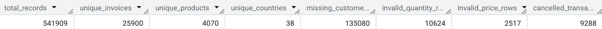

# 🛒 E-Commerce Customer Analytics & Revenue Insights (SQL)

[](https://cloud.google.com/bigquery)
[](#)
[](#)

<p align="center">
  
</p>

---
## 📖 Project Overview
This project analyzes over 500k customer transactions from an international online retail store. The goal is to clean transactional data and extract key business insights regarding **customer retention, churn risk, geographic revenue, and product velocity**.

---
## 🛠️ Tech Stack
* **Database Engine:** PostgreSQL / BigQuery
* **SQL Concepts:** Common Table Expressions (CTEs), Window Functions (`LAG`, `LEAD`, `NTILE`, `SUM() OVER`), Aggregations, Date Manipulation, Data Cleaning (DDL/DML).

---
## 📂 Dataset
The **Online Retail** dataset contains all transactional data occurring between **01/12/2010 and 09/12/2011** for a UK-based, non-store online retail business. The company primarily sells unique all-occasion gifts, with a significant portion of customers being wholesalers.

### Key Metrics
* **Total Records:** 541,909 rows
* **Timeframe:** Dec 1, 2010 – Dec 9, 2011
* **Unique Invoices:** 25,900
* **Unique Items:** 4,070 product codes
* **Unique Customers:** 4,372
* **Countries Represented:** 38 (Majority from the UK)
---
### Data Dictionary

| Column Name | Data Type | Description | Sample Value / Range |
| :--- | :--- | :--- | :--- |
| **`InvoiceNo`** | `String` / `Object` | A 6-digit integral number uniquely assigned to each transaction. If this code starts with 'C', it indicates a cancellation. | `536365`, `C536379` |
| **`StockCode`** | `String` / `Object` | Product (item) code assigned to a specific item. | `85123A`, `71053` |
| **`Description`** | `String` / `Object` | Product name/description. | `WHITE HANGING HEART T-LIGHT HOLDER` |
| **`Quantity`** | `Integer` | The quantities of each product (item) per transaction. Negative values indicate cancellations/returns. | `-80,995` to `80,995` |
| **`InvoiceDate`** | `Datetime` | The day and time when each transaction was generated. | `2010-12-01 08:26:00` |
| **`UnitPrice`** | `Float` | Unit price of the product in sterling (£). | `£0.00` to `£38,970.00` |
| **`CustomerID`** | `Float` / `Categorical` | A 5-digit integral number uniquely assigned to each customer. | `17850.0` |
| **`Country`** | `String` | Name of the country where the customer resides. | `United Kingdom`, `Germany` |

---
### Data Quality Issues & Considerations

> [!NOTE]
> * **Missing Values (Blanks):**
>   * `CustomerID` is missing for **24.93%** of records (135,080 rows), representing guest checkout transactions.
>   * `Description` is missing in **0.27%** of records (1,454 rows).
> * **Negative Quantities & Prices:**
>   * Negative `Quantity` values represent canceled orders or product returns.
>   * Zero or negative `UnitPrice` values occur in rare cases (e.g., system adjustments, bad debt adjustments).

```sql
SELECT 
    COUNT(*) AS total_records,
    COUNT(DISTINCT InvoiceNo) AS unique_invoices,
    COUNT(DISTINCT StockCode) AS unique_products,
    COUNT(DISTINCT Country) AS unique_countries,
    COUNTIF(CustomerID IS NULL) AS missing_customers,
    COUNTIF(Quantity <= 0) AS invalid_quantity_rows,
    COUNTIF(UnitPrice <= 0) AS invalid_price_rows,
    COUNTIF(STARTS_WITH(InvoiceNo, 'C')) AS cancelled_transactions
FROM `sql-projects-503512.uci_online_retail.online_retail_staging`;
```


---
## 📁 Repository Structure
ecommerce-sales-analytics/
├── data/
│   └── netflix_titles.csv         # Raw CSV dataset from Kaggle
├── sql/
│   ├── 00_schemas.sql               # Raw table DDL
│   ├── 01_create_staging.sql        # Casts raw string data into strongly-typed columns
│   ├── 02_data_quality_assessment.sql # Audit queries to detect missing values, anomalies, duplicates & cancellations
│   ├── 03_data_cleaning.sql         # Builds production-ready cleaned view/table
│   ├── 04_eda_queries.sql           # Exploratory Data Analysis (14 queries)
│   └── 05_business_insights.sql     # Advanced Insights (RFM, MoM growth, Cohorts)
├── outputs/                       # Exported query results (.csv files)
├── docs/                          # Snapshots of queries' results
└── README.md                      # Project documentation

---
## 📈 Key Business Findings & Recommendations

