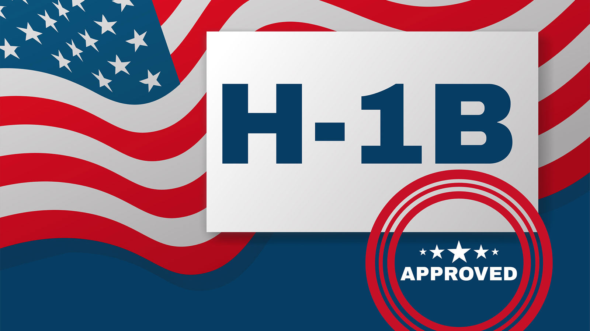
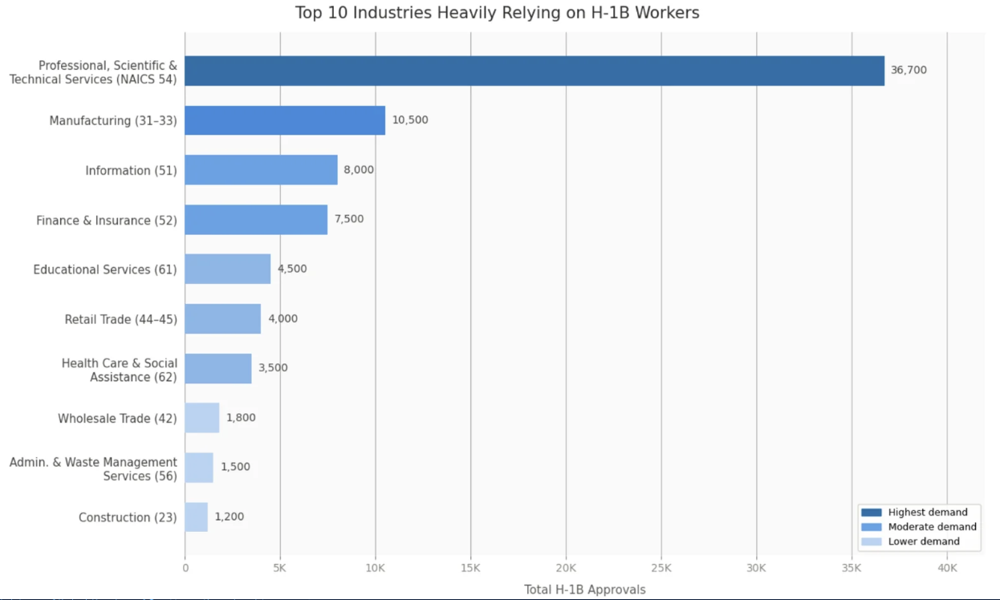
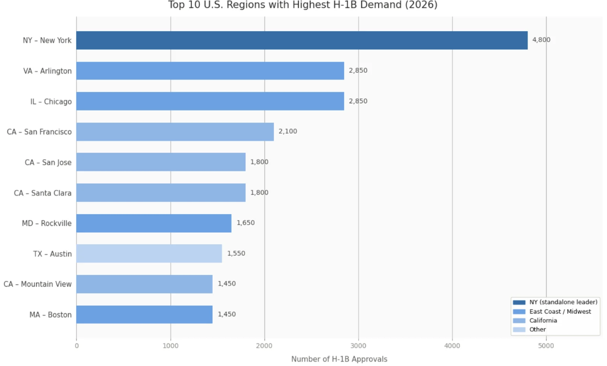
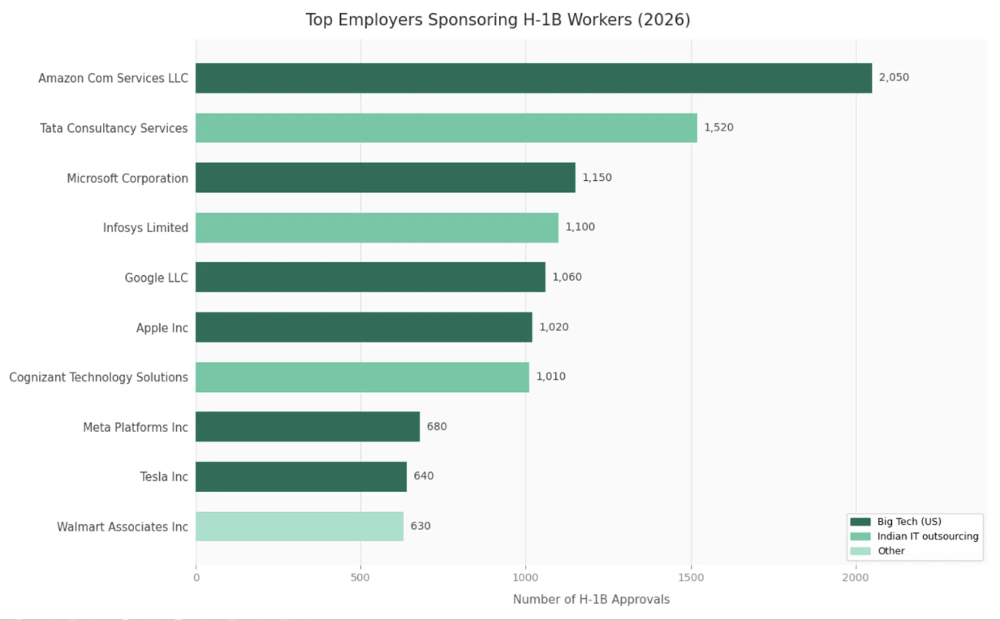

# 💼 H-1B Employer Sponsorship Analysis & Approval Prediction (FY2026)
<p align="center">
  
  
  
  
  
  
</p>

<p align="center">
  
</p>

---
## 📌 Executive Summary
This project analyzes **USCIS H-1B petition data (FY2026, ~24,000 employer-level records)** to identify which industries, regions, and employers rely most heavily on H-1B sponsorship, and whether approval outcomes can be predicted from employer-level features.

Using **Python (pandas, scikit-learn)**, raw USCIS employer data was cleaned and aggregated into approval/denial totals, explored across industry, geography, and employer dimensions, then used to train and evaluate **logistic regression** and **random forest** classifiers predicting petition approval.

> 🛑 [!NOTE]
> **Team & Role:** This was a group project (5 person team, UC Berkeley). This repo contains my individual contribution — the full cleaning, EDA, and modeling pipeline below. Teammates contributed to research framing and the accompanying presentation, **[link here](https://www.canva.com/design/DAHHa-OeAJo/FnMrY5LIeqPE-pavidpAlQ/edit)**.

---
## 💻 Tech Stack

- **Language:** Python 3
- **Data Wrangling:** `pandas`, `NumPy`
- **Modeling:** `scikit-learn` (`LogisticRegression`, `RandomForestClassifier`)
- **Visualization:** `matplotlib`, `seaborn`, `plotly`
- **Techniques:**
  - Groupby aggregation across industry / geography / employer
  - Feature engineering (approval rate, binary target, top-N employer bucketing)
  - One-hot encoding + class-weighted classification
  - Model evaluation: confusion matrix, precision/recall/F1, ROC-AUC

------
## 📁 Repository Structure

```text
h1b-employer-sponsorship-analysis/
│
├── data/
│   └── H1B Employer Data 2026.csv (USCIS source)                      
│
├── docs/
│   └── images/                     # Exported chart screenshots (industry, geography, employer, ROC curves)
│
├── kartlyn-h1b-analysis.ipynb          # My individual contributions: Full cleaning, EDA & modeling pipeline
│
└── README.md
```
---
## 📂 Dataset Overview
The **USCIS H-1B Employer Data Hub (FY2026)** contains employer-level petition counts — approvals and denials broken out by petition type (new employment, continuation, employer change, amendment) — for every H-1B sponsoring employer in the fiscal year.
### Key Metrics
* **Total Records:** 24,362 employer-level rows
* **Fiscal Year:** 2026
* **Unique Industries (NAICS):** 20 categories
* **Petition Types Aggregated:** 6 approval types + 6 denial types → collapsed into Total Approvals / Total Denials

---
## 🚨 Data Quality Issues & Considerations
> [!WARNING]
> - **Missing Values:**
>   - **Employer Name:** Missing in 2 rows.
>   - **Industry (NAICS) Code:** Missing in 847 rows (3.5%) — excluded from industry-level aggregation.
>   - **Petitioner State:** Missing in 6 rows.
> - **Class Imbalance:** The vast majority of employer records are majority-approved (4,700 of 4,873 in the test set) vs. majority-denied (173) — a >27:1 imbalance that limits what employer/industry/state alone can predict.
> - **Aggregation Level:** Data is employer-level, not case-level — individual petition outcomes (wage, job duties, RFE history) aren't captured.

---
## 📊 Key Findings & Insights

1. **Professional, Scientific & Technical Services dominates H-1B demand**, accounting for ~37,200 total approvals — more than 3.5x the next-largest industry (Manufacturing, ~10,160), with Information (~7,500) and Finance & Insurance (~7,300) rounding out the top four.
   - *Insight:* H-1B sponsorship is heavily concentrated in tech-adjacent professional services rather than spread evenly across the economy — useful context for job seekers weighing industry choice against sponsorship likelihood.



2. **New York and the Bay Area anchor sponsorship geography.** New York, NY (4,834 approvals) and Arlington, VA (2,840) lead, with San Francisco, San Jose, Santa Clara, and Mountain View collectively placing four Bay Area cities in the top 10.
   - *Insight:* Confirms sponsorship activity clusters around major tech and consulting hubs rather than being nationally distributed.



3. **Sponsorship is top-heavy among a small set of employers.** Amazon (2,008), Tata Consultancy Services (1,518), Microsoft (1,179), Infosys (1,139), and Google (1,040) account for a disproportionate share of approvals relative to the ~24,000 employers in the dataset.
   - *Insight:* Large tech firms and IT consulting/staffing firms (TCS, Infosys, Cognizant) both appear prominently — two structurally different sponsor profiles worth distinguishing in future work.



### Model Evaluation Performance

| Model | Accuracy | Precision | Recall | F1 Score | ROC-AUC |
| :--- | :---: | :---: | :---: | :---: | :---: |
| **Logistic Regression** | 0.90 | 0.97 | 0.93 | 0.95 | 0.53 |
| **Random Forest** | 0.68 | 0.97 | 0.69 | 0.81 | 0.54 |

---
## 🔍 Next Steps (What I Would Do If I Had More Time)
- **Employer segmentation:** Cluster sponsors into profiles (Big Tech vs. IT staffing/consulting vs. other) to see if approval patterns differ by sponsor type rather than industry alone.
- **Interactive dashboard:** Rebuild the top industry/region/employer views in Tableau or Power BI for a filterable, presentation-ready version.