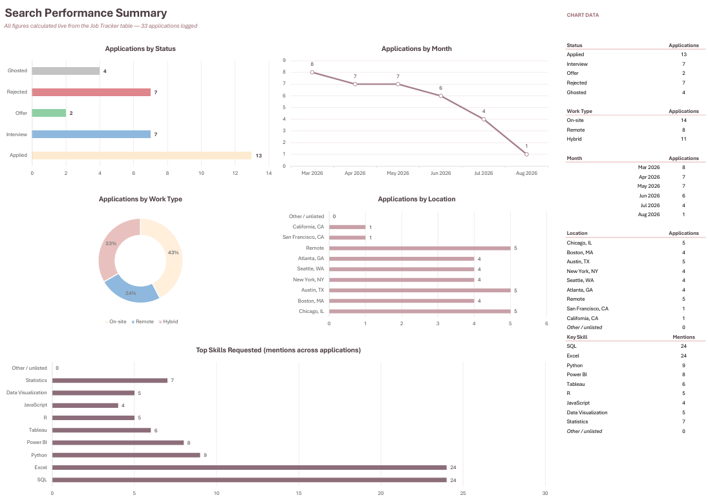

# 📊 Job Application Tracker & Analytics Dashboard

An Excel-native tracker that turns a job search into a measurable funnel — 12 tracked fields per application, 6 live KPI cards, and a five-chart analytics dashboard, all driven by formulas over a single structured table. No macros, no add-ins, no manual chart edits.



---
## Why I built it?

Spreadsheets full of job applications are easy to start and impossible to learn from. I wanted three questions answered without re-counting rows by hand:

- Which stage is my funnel actually leaking at?
- Is my application volume trending up or down month over month?
- Which skills keep reappearing in the roles I want?

---
## 🛠️ Skills Demonstrated

* Excel structured tables 
* Conditional Formatting 
* Data Validation
* Dynamic Date Functions

> No VBA, no macros, no external dependencies.
---
## 🚨Data Note

The published workbook contains **synthetic sample data** — 33 fictional applications at invented companies — so the dashboard can be demonstrated without exposing a real job search. The structure, formulas and formatting are production-ready; only the rows are fictional.

---
## Features

| Feature | Implementation |
| --- | --- |
| 6 live KPI cards | `COUNTA` / `COUNTIF` / `AVERAGE` over structured table references |
| Status & Type chips | Conditional formatting, priority-ordered above row banding |
| Rolling 6-month trend | `EOMONTH` anchored to `MAX(Date Applied)` — the window moves itself |
| Skill frequency count | `SUMPRODUCT` + `SEARCH` with delimiter padding to kill substring false positives |
| Deadline watch | Auto-highlights any deadline within 14 days of `TODAY()` |
| Validated entry | Dropdowns on Status and Type keep aggregations from fragmenting |

---
## KPI definitions

| KPI | Formula |
| --- | --- |
| Total Applications | `=COUNTA(Table2[Company])` |
| Interviews | `=COUNTIF(Table2[Status],"*Interview*")` |
| Offers | `=COUNTIF(Table2[Status],"*Offer*")` |
| Interview Rate | `=(Interviews + Offers) / Total Applications` |
| Offer Rate | `=Offers / Total Applications` |
| Avg Salary Posted | `=AVERAGE(Table2[Salary])` |

---
## 📊 Dashboard

| Chart | Type | Question it answers |
| --- | --- | --- |
| Applications by Status | Horizontal bar | Where does the funnel leak? |
| Applications by Month | Line, rolling 6 months | Am I keeping my volume up? |
| Applications by Work Type | Doughnut | On-site vs remote vs hybrid mix |
| Applications by Location | Horizontal bar | Which markets am I targeting? |
| Top Skills Requested | Horizontal bar | What should I learn next? |

Each chart reads a formula-driven helper block in columns `P:Q` of the Summary sheet, so everything refreshes on data entry with 0 chart editing.

---
## Two formulas worth a look

Rolling 6-month window — no hardcoded dates, re-anchors to the most recent application:

```excel
=EOMONTH(MAX(Table2[Date Applied]),ROW()-23)+1
```

```excel
=SUMPRODUCT(--ISNUMBER(
    SEARCH(","&$P36&",",
        ","&SUBSTITUTE(Table2[Key Skills],", ",",")&",")
    )
)
```

---
## 📁 Repository Structure

```text
job-application-tracker/
├── README.md
├── Job-Tracker-Dashboard.xlsx
└── images/
    ├── 01-tracker.png
    ├── 02-summary-dashboard.png
    └── 03-kpi-cards.png
```

---
## How To Use
1. Download `Job-Tracker-Dashboard.xlsx` and open it in Excel (Microsoft 365 or 2021+).
2. Add an application on the tracker table.
3. Pick Status and Type from the dropdowns — chips and KPI cards update instantly.
4. Open the **Summary** sheet; all 5 charts have already recalculated.
