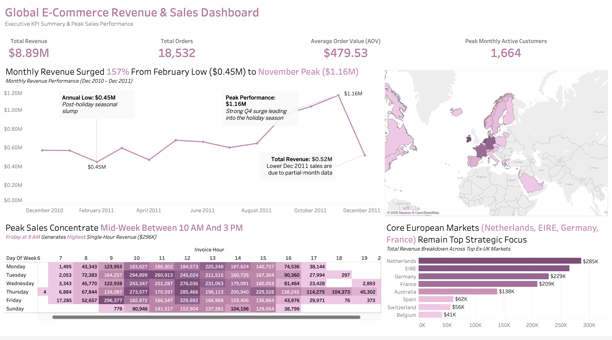
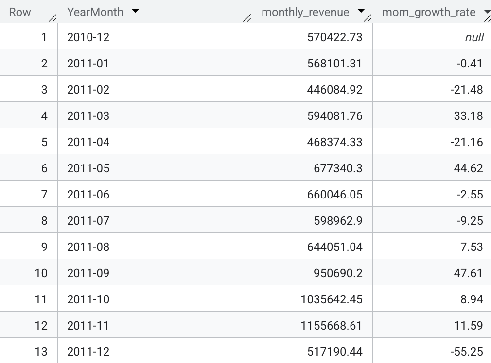
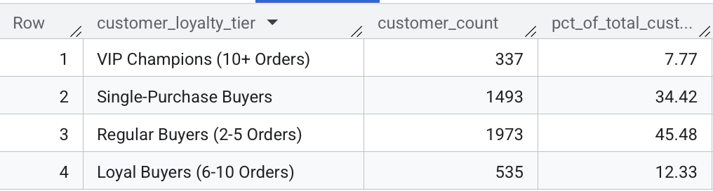
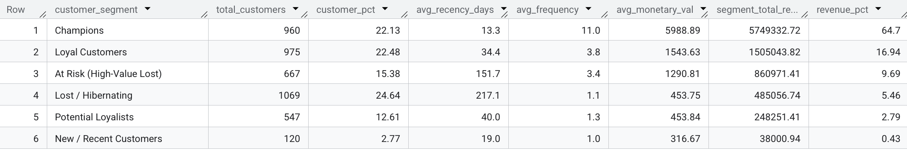
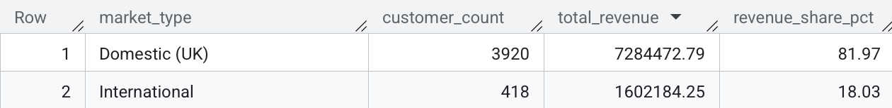
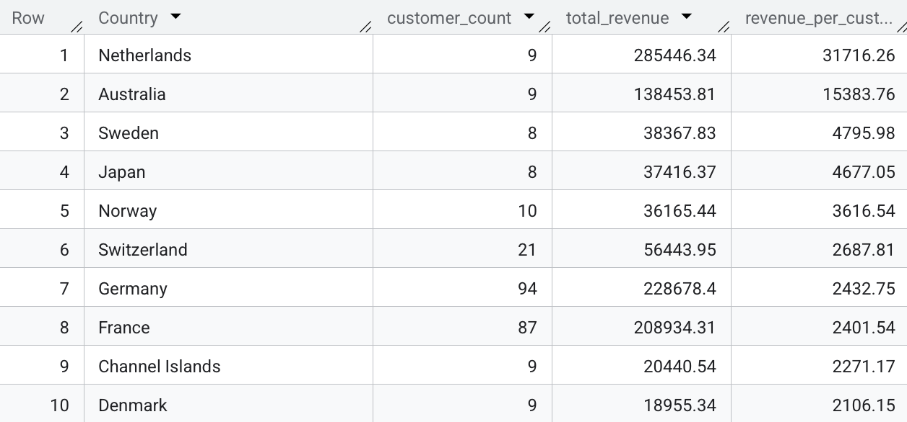
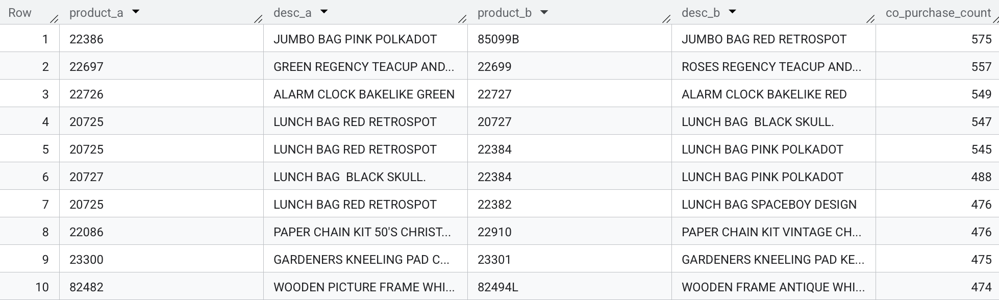
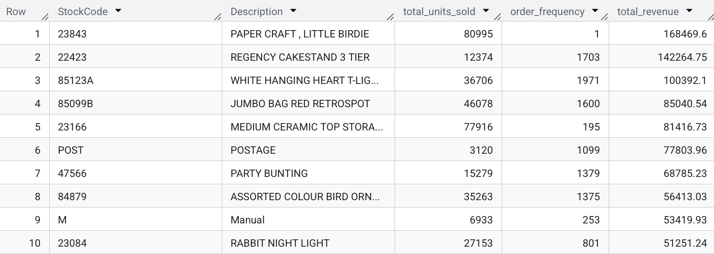

# 🛒 E-Commerce Customer Analytics & Revenue Insights (SQL)

[](https://cloud.google.com/bigquery)
[](#)
[](https://www.tableau.com/)
[](#)

<p align="center">
  
</p>

---
## 📌 Executive Summary
This project delivers an end-to-end data engineering and advanced analytics pipeline built on the **UCI Online Retail Dataset** (~540,000 transaction records spanning 2010–2011). 

Using **Google BigQuery**, raw transactional data was transformed into a standardized, production-ready data layer through modular SQL scripting. The project addresses key business domains, including sales velocity, product demand, **RFM (Recency, Frequency, Monetary) customer segmentation**, and **Cohort Retention Analysis**.

---
## 💻 Tech Stack
* **Database Engine:** Google BigQuery (Standard SQL)
* **Advanced SQL Techniques:**
  * CTEs (`WITH` clauses) for multi-stage analytics
  * Window Functions (`ROW_NUMBER()`, `NTILE()`, `LAG()`)
  * Date/Timestamp functions (`DATE_DIFF()`, `TIMESTAMP_TRUNC()`, `FORMAT_TIMESTAMP()`)
  * Aggregations & Conditional Logic (`CASE WHEN`, `HAVING`)
  * Market Basket Self-Joins

---
## 📁 Repository Structure

Designed for data integrity, reproducibility, and query efficiency:

```text
ecommerce-sales-analytics/
│
├── data/
│   ├── raw/                      # Unprocessed raw transaction data (Online Retail.xlsx / CSV)
│   └── clean/                    # Exported production analytics datasets (1000 rows sample)
│
├── docs/
│   ├── images/                   # Screenshots of query results
│   └── business_questions.md     # 14 analytics business questions
│
├── outputs/
│   └── query_results/            # Exported SQL query outputs
│
├── sql/
│   ├── 00_schemas.sql            # Define raw ingestion table schemas
│   ├── 01_create_staging.sql            # Type casting, text normalization & temporal feature engineering
│   ├── 02_data_quality_assessment.sql # Data profiling, missing value audit & anomaly detection
│   ├── 03_data_cleaning.sql      # Deduplication & filtering rules (Production Table)
│   ├── 04_eda_queries.sql        # 14 structured EDA queries across revenue, products & geography
│   └── 05_business_insights.sql  # Strategic analytics: RFM Segmentation & Cohort Retention
│
└── README.md                     # Executive summary & pipeline documentation
```

---
## 📂 Dataset Overview
The **UCI Online Retail** dataset contains all transactional data occurring between **01/12/2010 and 09/12/2011** for a UK-based, non-store online retail business. The company primarily sells unique all-occasion gifts, with a significant portion of customers being wholesalers.

### Key Metrics
* **Total Records:** 541,909 rows
* **Timeframe:** Dec 1, 2010 – Dec 9, 2011
* **Unique Invoices:** 25,900
* **Unique Items:** 4,070 product codes
* **Unique Customers:** 4,372
* **Countries Represented:** 38 (Majority from the UK)

---
### 📑 Data Dictionary

| Column Name | Data Type | Description | Sample Value / Range |
| :--- | :--- | :--- | :--- |
| **`InvoiceNo`** | `STRING` | A 6-digit integral number uniquely assigned to each transaction. Prefixed with 'C' for cancellations. | `536365`, `C536379` |
| **`StockCode`** | `STRING` | Product (item) code assigned to a specific item. | `85123A`, `71053` |
| **`Description`** | `STRING` | Product name/description. | `WHITE HANGING HEART T-LIGHT HOLDER` |
| **`Quantity`** | `INT64` | The quantities of each product per transaction. Negative values indicate cancellations/returns. | `-80,995` to `80,995` |
| **`InvoiceDate`** | `TIMESTAMP` | The day and time when each transaction was generated. | `2010-12-01 08:26:00` |
| **`UnitPrice`** | `FLOAT64` | Unit price of the product in sterling (£). | `£0.00` to `£38,970.00` |
| **`CustomerID`** | `STRING` | A 5-digit integral number uniquely assigned to each registered customer account. | `17850` |
| **`Country`** | `STRING` | Name of the country where the customer resides. | `United Kingdom`, `Germany` |

---
### 🚨 Data Quality Issues & Considerations

> [!NOTE]
> * **Missing Values (Blanks):**
>   * `CustomerID` is missing for **24.93%** of records (135,080 rows), representing guest checkout transactions.
>   * `Description` is missing in **0.27%** of records (1,454 rows).
> * **Negative Quantities & Prices:**
>   * Negative `Quantity` values represent canceled orders or product returns.
>   * Zero or negative `UnitPrice` values occur in rare cases (e.g., system adjustments, bad debt adjustments).

```sql
SELECT 
    COUNT(*) AS total_records,
    COUNT(DISTINCT InvoiceNo) AS unique_invoices,
    COUNT(DISTINCT StockCode) AS unique_products,
    COUNT(DISTINCT Country) AS unique_countries,
    COUNTIF(CustomerID IS NULL) AS missing_customers,
    COUNTIF(Quantity <= 0) AS invalid_quantity_rows,
    COUNTIF(UnitPrice <= 0) AS invalid_price_rows,
    COUNTIF(STARTS_WITH(InvoiceNo, 'C')) AS cancelled_transactions
FROM `sql-projects-503512.uci_online_retail.online_retail_staging`;
```


---
## 📊 Interactive Data Visualization (Tableau)



👉 **[View Interactive Tableau Dashboard Here](https://public.tableau.com/app/profile/trinh.nguyen3873/viz/UCIOnlineRetail_17853364241720/Dashboard1?publish=yes)**

---
## 📈 Key Business Findings & Recommendations

1. Monthly sales experience explosive growth leading into Q4, jumping +47.61% MoM in September 2011 ($950.7K) and reaching an all-time peak of $1.155M in November 2011.

* **Actionable Strategy:** Highlights strong holiday gift-buying seasonality. Supply chain, warehouse staffing, and inventory stocking must be finalized by **late August** to mitigate supply chain bottlenecks and prevent stockouts during the September–November peak demand window.

---
2. 34.42% of customers (1,493 buyers) make only a single purchase and never return. Conversely, 45.48% (1,973 buyers) make 2–5 repeat purchases, while only 7.77% (337 buyers) become 10+ order power buyers.


* **Actionable Strategy:** The primary growth bottleneck is converting single-purchase buyers into regular buyers. Implement an automated **30-day post-purchase lifecycle email journey** offering personalized cross-sell recommendations and a time-bound discount on second orders to lift customer retention.

---
3. RFM Segmentation revealed that **15.38% of customers (667 accounts)** belong to the "At Risk (High-Value Lost)" cohort. These accounts were historically high-volume buyers (avg. **3.4 orders** and **$1,290.81 LTV**), but have not made a purchase in over **150 days**.


* **Actionable Strategy:** Deploy automated win-back re-engagement campaigns targeting accounts with >90 days of inactivity. Because acquiring a new customer costs 5x more than retaining an existing one, reclaiming even 10% of this segment recovers ~$86K in high-margin revenue.

---
4. While domestic UK buyers account for **81.97% of total revenue ($7.28M)**, international customers yield dramatically higher spend per user. The **Netherlands leads with $31,716.26 revenue per customer** (285.4K across 9 buyers), followed by **Australia ($15,383.76 per customer)**.



* **Actionable Strategy:** Transition overseas strategy from general B2C marketing to dedicated B2B wholesale channels. Establish localized wholesale pricing, bulk shipping incentives, and dedicated account management in top international markets (Netherlands, Australia, Germany, and France).

---
5. Co-purchase analysis revealed highly specific product pairs frequently bought together in the same order, led by matching color variations like **"JUMBO BAG PINK POLKADOT" & "JUMBO BAG RED RETROSPOT" (575 co-purchases)** and **Teacup sets (557 co-purchases)**.


* **Actionable Strategy:** Provides direct data-backed rules for e-commerce cross-sell recommendations ("Frequently Bought Together") and multi-pack item bundling to increase Average Order Value (AOV).

---
6. Top SKU analysis revealed a stark operational difference between one-off bulk transactions and steady retail demand. The top product by sales, **"PAPER CRAFT, LITTLE BIRDIE" ($168.5K)**, was bought in a single bulk order (80,995 units). Conversely, evergreen core items like **"REGENCY CAKESTAND 3 TIER" ($142.3K)** drove sales consistently across **1,703 separate orders**.


* **Actionable Strategy:** Separate B2B bulk purchase anomalies from core reorder forecasting models. Standard inventory reordering should be optimized around steady-state, high-frequency SKUs to prevent overcapitalization on low-frequency outlier items.

---
## 🔍 Next Steps (What I Would Do If I Had More Time)

If I had more time, I would expand this project by:

* **Predictive Modeling with Python (XGBoost or Logistic Regression):** Train a ML model to forecast customer churn and predict individual Customer Lifetime Value (CLV).
* **Pipeline Automation:** Refactor SQL into **dbt** for automated data testing, quality documentation, and scheduled daily updates.
* **Experimentation:** Design and run A/B tests on win-back marketing campaigns to measure incremental lift and impact.