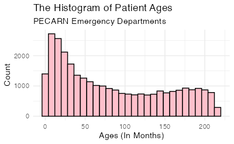
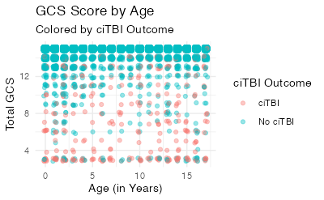
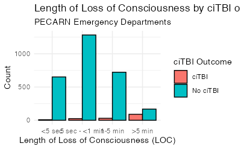
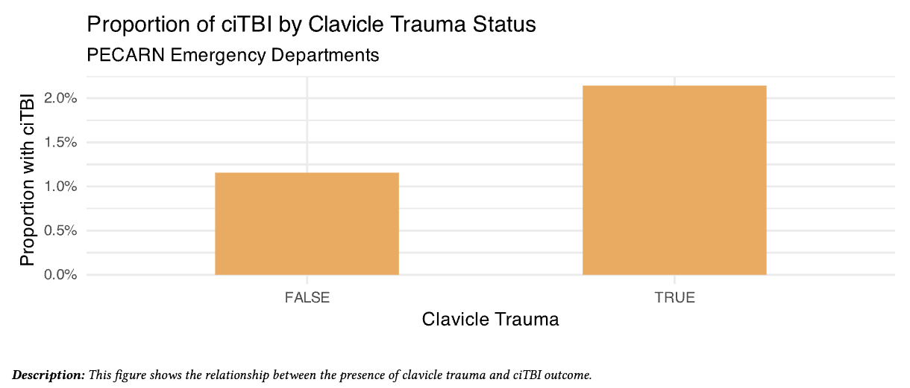

# 🏥 Pediatric Emergency Room Visits: Traumatic Brain Injury (ciTBI) Analysis


</div>
<p align="center">
  
</p>

> **An exploratory and explanatory data analytics workflow investigating clinical and demographic predictors of Clinically Important Traumatic Brain Injury (ciTBI) in pediatric emergency care.**

---
## 📌 Overview

This project analyzes a curated subset of the **Pediatric Clinically Important Traumatic Brain Injury (ciTBI)** dataset from the **Pediatric Emergency Care Applied Research Network (PECARN)**. The dataset encompasses clinical evaluations, demographic profiles, and injury mechanisms for children presenting to the emergency department with acute head trauma.

The final communication product is tailored for a hypothetical clinical stakeholder—**Dr. Bayes**, a pediatric emergency physician and clinical researcher—translating complex statistical distributions into actionable bedside insights.

---
## 🎯 Project Goals

* **Clinical Trend Identification:** Conduct exploratory data analysis (EDA) to uncover key patterns and physiological risk factors associated with positive ciTBI outcomes.
* **Healthcare Data Wrangling:** Perform rigorous data cleaning, missing value handling, and data type transformations on a complex clinical dataset.
* **Stakeholder Communication:** Select, polish, and synthesize key findings into a concise, executive-level clinical report.

---
## 🛠️ Tech Stack & Methodology

**Tools Used:** R / Quarto (`.qmd`), Data Visualization (`ggplot2`), Data Wrangling (`tidyverse`).

### 1. Data Foundation (`data/`)
* **Primary Dataset:** `citbi.csv` (Pediatric emergency department head trauma evaluations)
* **Data Dictionary:** `citbi_data_dictionary.xlsx`
* **Target Outcome:** Clinically Important Traumatic Brain Injury (ciTBI)

### 2. Data Cleaning & Preprocessing
* **Sentinel Value Conversion:** Re-coded domain-specific sentinel codes (e.g., `91`, `92`) to true `NA` values to preserve statistical integrity.
* **Semantic Renaming:** Standardized ambiguous clinical acronyms and column names to clear, readable terminology.
* **Type Casting & Factor Enforcement:** Converted character variables into factors and transformed binary indicators into logical types.
* **Integrity Validation:** Enforced rigorous post-cleaning checks on data types and missingness proportions.

### 3. Exploratory Data Analysis (EDA)
* **Univariate Distributions:** Evaluated patient demographic profiles, age groupings, and baseline clinical attributes.
* **Bivariate & Multivariate Modeling:** Analyzed relationships across key interactions:
  1. Age distribution vs. ciTBI occurrence
  2. Loss of Consciousness (LOC) duration vs. ciTBI severity
  3. Glasgow Coma Scale (GCS) score interactively mapped across patient age and outcome
* **Functional Programming:** Developed custom reusable functions to programmatically summarize categorical distributions (e.g., gender-stratified cross-tabulations).

### 4. Explanatory Reporting
Synthesized EDA artifacts into a streamlined report for Dr. Bayes, featuring **3–5 high-impact, presentation-ready visualizations** accompanied by clinical interpretations.

---
## 📁 Repository Structure
```text
├── data/                       # Contains citbi.csv & citbi_data_dictionary.xlsx & project info (.pdf file)
├── plots/                      # Exported high-resolution visualization artifacts
├── errors_and_lessons/         # Project reflections & edge-case notes
│   └── errors_and_lessons.qmd  
│   └── uninformative_plot.png  
├── preparation.qmd             # Data cleaning, transformation & primary EDA
├── report/                       
│   └── report.qmd              # Source code for client presentation report 
│   └── report.pdf              # Rendered executive PDF report
├── results/                       
│   └── plots/                  # Screenshots of code results 
│   └── RDS_files/              # Processed data objects & intermediate models
└── README.md                   # Project documentation
```

---
## 📊 Key Findings & Clinical Recommendations

### 🔍 Key Findings

* **Infants & Adolescents Are Highest-Volume Presentations:** Emergency visits for pediatric head trauma are strongly right-skewed, peaking heavily in early infancy (~16 months) before declining, with a secondary resurgence during adolescence (150–200 months).



* **GCS Score Overrides Age as a Predictor:** Neurological severity (total Glasgow Coma Scale score) is a far stronger predictor of ciTBI than patient age; holding GCS constant shows negligible variation in ciTBI proportion across age groups.
> Lower total GCS scores consistently drive higher ciTBI risk, demonstrating that total GCS is a far stronger predictor of ciTBI than age alone.



* **Prolonged Loss of Consciousness (LOC) Drives Risk:** The probability of ciTBI increases significantly with LOC duration, peaking in patients with **LOC > 5 minutes** (accounting for 90 positive ciTBI cases).
> Patients experiencing **LOC > 5 minutes** exhibited the highest volume of positive ciTBI cases (90 confirmed cases), serving as a crucial red flag for emergency triaging.



* **Visible Head, Face, or Neck Trauma Nearly Doubles ciTBI Risk:** Patients with any evidence of trauma above the clavicles — laceration, abrasion, or hematoma to the scalp, face, or neck — show a ciTBI rate of **2.14%** (417/19,465) versus **1.16%** (125/10,810) in patients without.



---
### 🩺 Clinical & Operational Recommendations

* **Prioritize Immediate CT Scans for LOC > 5 Minutes:** Establish strict clinical triage protocols requiring rapid neuroimaging and monitoring for pediatric patients with documented loss of consciousness exceeding 5 minutes.
* **Treat Visible Above-Clavicle Trauma as a Risk Modifier, Not a Decision Rule:** External signs of head, face, or neck injury raise ciTBI probability roughly two-fold, but because the marker appears in nearly two-thirds of presentations it cannot stand alone as an imaging trigger. It is appropriately used alongside GCS and LOC duration, consistent with its role in the published PECARN prediction rule.
* **Standardize GCS-Based Risk Stratification:** Rely on total GCS score over patient age when evaluating ciTBI probability, avoiding age-biased assumptions during initial emergency department triage.
* **Target Infant Safety Education:** Focus pediatric head trauma prevention campaigns on infant safety (0–2 years) and adolescent injury prevention, aligned with the two primary volume peaks.

