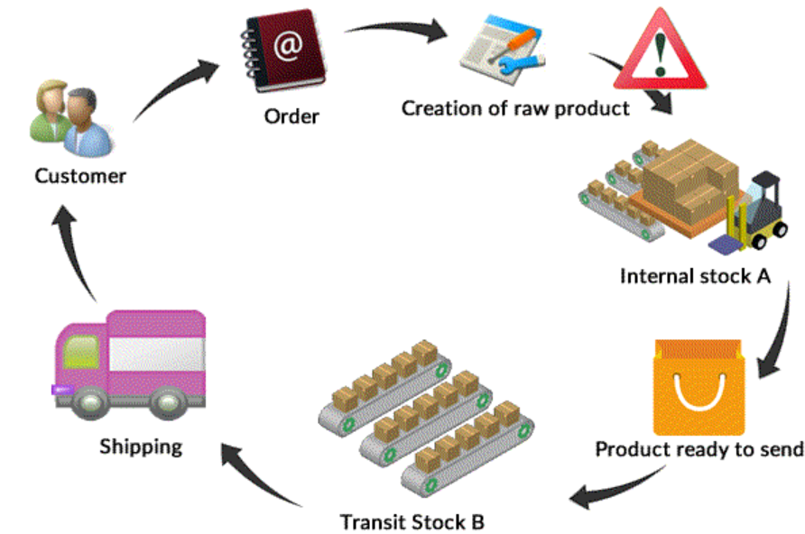
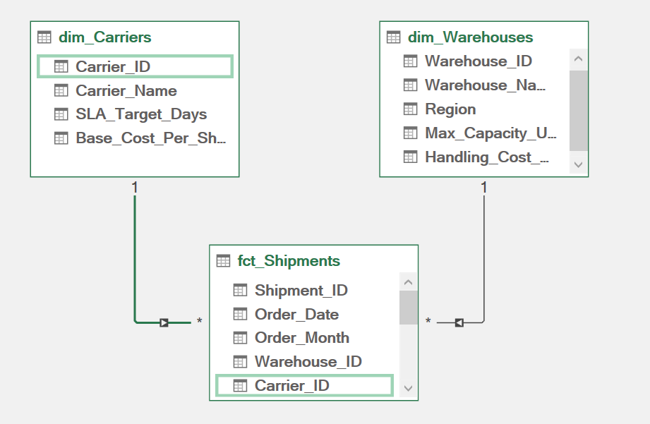

# 📦 Supply Chain SLA & Freight Performance Analysis

<p align="left">
  
  
  
  
</p>

<p align="center">
  
</p>

> A single-screen executive dashboard evaluating carrier SLA compliance, warehouse fulfilment reliability, freight spend, and modeled penalty exposure across 1,000 outbound shipments — built end-to-end in Excel with Power Query, a star-schema data model, and 13 DAX measures.

---
## 📌 Project Overview
Distribution networks commit to a **promised ship date** and are measured against it. This project asks a single operating question:

> **Where is the network losing SLA compliance, and what is the cheapest lever to close the gap?**

Three flat CSVs are ingested through **Power Query**, shaped into a **star schema** (one fact table, two dimensions), loaded to the **Power Pivot data model**, and measured with **13 DAX measures**. Six PivotTables on a `Detail` tab feed chart-ready ranges on a `Helper` tab, which drive a single-screen `Overview` dashboard. A separate `Scenario_Analysis` tab models the compliance and penalty impact of widening the promise window.

The headline result is not "which carrier is worst." It is that **the network misses narrowly** — a majority of breaches miss by exactly one day — which makes **promise-setting**, not carrier replacement, the highest-return intervention.

---
## 🛠️ Tools & Technologies Used
* **Application:** Microsoft Excel (Microsoft 365)
* **ETL:** Power Query (M) — typed ingestion, derived columns, conditional bucketing
* **Modeling:** Power Pivot — star schema, one-to-many relationships, 13 DAX measures
* **Reporting:** PivotTables, PivotCharts, 7 slicers (Region · Carrier · Order Year · Order Month · Priority · Area · Timeline)
* **Sensitivity Analysis:** Buffer-day scenario table (0–4 days) with penalty exposure and compliance recomputation
* **Data Generation:** Python (synthetic star-schema generator, fixed seed)
* **Version Control:** Git & GitHub

---
## 📂 Dataset Overview
> [!NOTE]
> **This dataset is synthetic and generated for this project.** It is not real operational data and is not sourced from a public dataset. Public supply-chain datasets are either heavily reused in portfolios (making the analysis indistinguishable from hundreds of others) or lack the promised-vs-actual date pair that SLA analysis requires. Generating the data made it possible to control the schema and the join structure — but it also means **every finding below describes this generated dataset, not the real world.**

### Star Schema
<p align="center">
  
</p>

| Table | Grain | Rows | Key Fields |
| :--- | :--- | :---: | :--- |
| **`fct_Shipments`** | One row per shipment | 1,000 | `Shipment_ID`, `Order_Date`, `Warehouse_ID`, `Carrier_ID`, `Promised_Ship_Date`, `Actual_Ship_Date`, `Shipment_Weight_Lbs`, `Freight_Cost` |
| **`dim_Warehouses`** | One row per warehouse | 6 | `Warehouse_ID`, `Warehouse_Name`, `Region`, `Max_Capacity_Units`, `Handling_Cost_Per_Unit` |
| **`dim_Carriers`** | One row per carrier | 5 | `Carrier_ID`, `Carrier_Name`, `SLA_Target_Days`, `Base_Cost_Per_Shipment` |

### Key Metrics
* **Period covered:** Aug 2025 – Jul 2026 (12 months)
* **Total shipments:** 1,000
* **Warehouses / Regions:** 6 across 4 regions (US-East, US-South, US-Central, US-West)
* **Carriers:** 5, with contractual SLA windows of 2–5 days
* **Total freight spend:** $218,688.52
* **SLA target:** 90% on-time ship rate

---
## 🚨 Data Quality Issues & Considerations

> [!WARNING]
> - **Synthetic data.** Patterns in this dataset were generated, not observed. No finding here should be read as a claim about real carrier or warehouse performance.
> - **Ship date, not delivery date.** The fact table records when a shipment *left* the warehouse against when it was *promised to leave*. This measures fulfilment and dock performance — **not transit time or delivery reliability.** The word "delivery" is deliberately avoided throughout the workbook.
> - **No penalty field exists in the data.** The `$75 per breach-day` rate used in `Modeled Penalty Exposure` is an **illustrative assumption declared on the `Assumptions` tab**, not a contractual figure. Every penalty number in this project is a modeled scenario, not a measured cost.
> - **`Max_Capacity_Units` and `Handling_Cost_Per_Unit` are unusable.** Both are expressed per *unit*, but the fact table records *weight*, not units. There is no join path between them, so **no capacity-utilization or handling-cost analysis is possible.** These columns are documented and deliberately left unanalyzed.
> - **Small per-segment samples.** Each carrier covers only ~190–210 shipments. The full carrier spread is 4.7 percentage points, which is well inside what sampling noise can produce at this size — see Finding 3.
> - **Early shipments count as on-time.** Shipping ahead of the promise date is treated as compliant, not as a separate variance category.

---
## 📁 Repository Structure

```text
supply-chain-analytics-excel/
│
├── data/
│   ├── dim_Carriers.csv                        # 5 carriers, SLA windows & base cost
│   ├── dim_Warehouses.csv                      # 6 warehouses, region & capacity attributes
│   └── fct_Shipments.csv                       # 1,000 shipments (Aug 2025 – Jul 2026)
│
├── docs/
│   └── images/                                 # Banner, star schema, dashboard export
│
├── workbook/
│   └── Supply_Chain_SLA_Freight_Analysis.xlsx  # Full model: 9 tabs, 13 measures, 6 pivots
│
└── README.md
```

### Workbook Tabs

| Tab | Purpose |
| :--- | :--- |
| **`Overview`** | Single-screen executive dashboard — 5 KPI cards, 6 charts, 4 numbered sections |
| **`Detail`** | Six supporting PivotTables — the evidence layer behind every dashboard chart |
| **`Helper`** | Chart-ready static ranges extracted from the pivots (keeps charts stable under slicing) |
| **`Scenario_Analysis`** | Buffer-day sensitivity model (0–4 days) with compliance and penalty recomputation |
| **`Assumptions`** | Every declared constant in one place — SLA target, penalty rate, breach definition |
| **`raw_*`** | Source extracts of the three loaded tables |

---
## 🧹 Data Preparation Workflow (Power Query)
All three CSVs are ingested with explicit type declarations rather than schema auto-detection, so a silent type coercion cannot corrupt a date comparison downstream. The fact table then gains five derived columns.

### Derived Columns Added to `fct_Shipments`

| Column | Logic | Purpose |
| :--- | :--- | :--- |
| **`Delay_Days`** | `Duration.Days([Actual_Ship_Date] - [Promised_Ship_Date])` | Signed variance — negative is early, positive is late |
| **`Is_OnTime`** | `if [Delay_Days] <= 0 then 1 else 0` | Binary flag enabling rate calculations as sums, not averages of averages |
| **`Delivery_Status`** | Conditional bucket on `Delay_Days` | Categorical split for the warehouse outcome chart |
| **`Cost_Per_lb`** | `[Freight_Cost] / [Shipment_Weight_Lbs]` | Normalizes freight spend against shipment size |
| **`Order_Month`** | `Date.StartOfMonth([Order_Date])` | Month grain for the trend line without a separate calendar table |

### Featured M: Building the SLA Fields
```m
let
    Source = Csv.Document(File.Contents("...\data\fct_Shipments.csv"),
        [Delimiter=",", Columns=8, Encoding=65001, QuoteStyle=QuoteStyle.None]),
    #"Promoted Headers" = Table.PromoteHeaders(Source, [PromoteAllScalars=true]),
    #"Changed Type" = Table.TransformColumnTypes(#"Promoted Headers",{
        {"Shipment_ID", type text}, {"Order_Date", type date},
        {"Warehouse_ID", type text}, {"Carrier_ID", type text},
        {"Promised_Ship_Date", type date}, {"Actual_Ship_Date", type date},
        {"Shipment_Weight_Lbs", Int64.Type}, {"Freight_Cost", type number}}),

    // Signed schedule variance — negative = shipped early
    #"Added Custom" = Table.AddColumn(#"Changed Type", "Delay_Days",
        each Duration.Days([Actual_Ship_Date] - [Promised_Ship_Date])),
    #"Changed Type1" = Table.TransformColumnTypes(#"Added Custom", {{"Delay_Days", Int64.Type}}),

    // Outcome bucket + binary on-time flag
    #"Added Conditional Column" = Table.AddColumn(#"Changed Type1", "Delivery_Status",
        each if [Delay_Days] <= 0 then "On-Time"
             else if [Delay_Days] = 1 then "Minor Delay"
             else "SLA Breach"),
    #"Added Conditional Column1" = Table.AddColumn(#"Added Conditional Column", "Is_OnTime",
        each if [Delay_Days] <= 0 then 1 else 0),

    // Freight normalization + month grain
    #"Added Custom1" = Table.AddColumn(#"Added Conditional Column1", "Cost_Per_lb",
        each [Freight_Cost] / [Shipment_Weight_Lbs]),
    #"Inserted Start of Month" = Table.AddColumn(#"Added Custom1", "Order_Month",
        each Date.StartOfMonth([Order_Date]), type date)
in
    #"Inserted Start of Month"
```

All three queries load as **connection-only + Add to Data Model**, keeping 1,000 fact rows out of the worksheet grid and inside the model where the relationships live.

---
## 📐 Data Model & DAX Measures
Two one-to-many relationships filter the fact table:

* `dim_Warehouses[Warehouse_ID]` **1 → \*** `fct_Shipments[Warehouse_ID]`
* `dim_Carriers[Carrier_ID]` **1 → \*** `fct_Shipments[Carrier_ID]`

Rates are computed as **measures over the full filter context**, never as an average of pre-aggregated percentages — the single most common error in Excel dashboards, and the reason the network figure below is a pooled 83.5% rather than the 83.4% you get by averaging the twelve monthly rates.

| # | Measure | Computes | Value (unfiltered) |
| :--: | :--- | :--- | ---: |
| 1 | `Total Shipments` | Row count of the fact table | 1,000 |
| 2 | `On-Time Shipments` | Shipments where `Delay_Days <= 0` | 835 |
| 3 | `SLA Breached Shipments` | Shipments where `Delay_Days > 0` | 165 |
| 4 | `SLA Compliance Rate` | On-time ÷ total | 83.5% |
| 5 | `SLA Target Gap` | Compliance rate − 90% target | −6.5 pp |
| 6 | `Total Breach Days` | Sum of positive `Delay_Days` | 288 |
| 7 | `Avg Delay When Late` | Breach days ÷ breached shipments | 1.75 days |
| 8 | `Avg Schedule Variance` | Mean signed `Delay_Days` across all shipments | +0.02 days |
| 9 | `Total Freight Cost` | Sum of `Freight_Cost` | $218,688.52 |
| 10 | `Avg Order Freight Cost` | Freight cost ÷ shipments | $218.69 |
| 11 | `Total Weight` | Sum of `Shipment_Weight_Lbs` | 1,272,995 lbs |
| 12 | `Freight Cost Per Lb` | Freight cost ÷ total weight | $0.1718 |
| 13 | `Modeled Penalty Exposure` | Breach days × assumed $75/day | $21,600 |

> Measure 8 is worth reading twice: the network's *average* schedule variance is essentially zero, because 26.8% of shipments go out early and offset the late ones. **Averages hide this problem entirely** — which is why compliance is measured as a rate against a threshold, not as a mean variance.

---
## 📊 Dashboard
<p align="center">
  
</p>

The `Overview` tab is a single screen, organized into four numbered sections, driven by four filter slicers:

| Section | Question It Answers |
| :--- | :--- |
| **01 Performance Overview** | Is the network trending toward the target, and does carrier choice explain the gap? |
| **02 Where The Breaches Concentrate** | Which regions and warehouses account for the shortfall? |
| **03 Delay & Buffer Optimization** | How badly do we miss, and what would a wider promise window buy? |
| **04 Executive Insights & Management Action** | Owner, action, and timeline for each finding |

Every chart is fed from the `Helper` tab rather than directly from a pivot, so slicer interaction cannot restructure a chart's series. Chart junk is stripped throughout: no gridlines, no chart borders, no 3-D, a single orange accent against greys.

---
## 💡 Key Findings & Strategic Recommendations

#### 1. The network runs 6.5 points below target, and only cleared it once in twelve months.
Pooled on-time ship rate is **83.5% against a 90% target** — 165 breaches out of 1,000 shipments. Monthly compliance ranged from **76.9% (Nov-25)** to **92.3% (Jul-26)**, and July was the only month above target. The eleven-month climb from the November trough is a real recovery, but a single month above threshold is not a trend.

* **Recommendation:** Treat Jul-26 as the reference month rather than the new baseline. Document what changed in scheduling and staffing that month and hold a monthly SLA review before declaring the target met.

#### 2. The network misses narrowly — 55% of breaches are exactly one day late.
Of 165 breaches, **91 miss by a single day**. Total breach exposure is **288 breach-days**, an average of **1.75 days when late**, and only 33 shipments (3.3% of volume) miss by three days or more. This is the central finding of the project: the failure mode is a **promise-setting problem, not a capability problem.**

* **Recommendation:** Add **one buffer day** to the promise window on structurally late lanes. Modeled impact: compliance rises **83.5% → 92.6%**, breach-days fall **288 → 123**, and modeled penalty exposure drops **$21,600 → $9,225 — a 57% reduction** — without changing a single operational process. Validate against customer-facing commitments before implementing; a wider promise window is a service-level trade, not a free win.

#### 3. Carrier performance does *not* separate at this sample size — warehouse performance does.
Carrier compliance spans only **80.7% (RailLink Logistics) to 85.4% (Swift Express)** — a **4.7-point spread across roughly 190–210 shipments each**, well within what random variation produces at that volume. Warehouse variation is materially wider: breach rates run from **14.0% (Newark Distribution Center)** to **19.2% (Columbus Regional Depot)**, a 5.2-point spread on comparable sample sizes.

* **Recommendation:** **Do not act on the carrier ranking.** Naming a "worst carrier" on a 4.7-point gap at n≈200 is exactly the inference this dataset cannot support. Direct root-cause effort at **Columbus Regional Depot** and **Atlanta Fulfillment Hub** (18.7%) instead, and revisit carriers only after accumulating enough volume for the spread to stabilize.

#### 4. Regional performance splits along warehouse lines, not geography.
**US-Central is the weakest region at 80.8%** and **US-East the strongest at 86.0%**. US-Central contains a single warehouse — Columbus — so the "regional" signal is entirely a warehouse signal wearing a regional label. US-South (330 shipments) and US-West (322) carry two-thirds of the volume between them.

* **Recommendation:** Read regional figures as warehouse figures until each region contains more than one facility. Rebalancing "US-Central staffing" is really rebalancing Columbus.

---
## 🎯 Scenario Analysis: Buffer-Day Sensitivity

The `Scenario_Analysis` tab recomputes compliance and penalty exposure across promise-window buffers of 0–4 days:

| Buffer Days Added | SLA Breaches | Compliance Rate | Breach Days | Modeled Penalty | Gap to 90% Target |
| :---: | :---: | :---: | :---: | ---: | :---: |
| **0** (current) | 165 | 83.5% | 288 | $21,600 | −6.5 pp |
| **1** | 74 | **92.6%** | 123 | **$9,225** | +2.6 pp |
| **2** | 33 | 96.7% | 49 | $3,675 | +6.7 pp |
| **3** | 16 | 98.4% | 16 | $1,200 | +8.4 pp |
| **4** | 0 | 100.0% | 0 | $0 | +10.0 pp |

The curve is steeply front-loaded: **the first buffer day captures 91 of the 165 breaches.** Days two through four deliver progressively less and cost progressively more in customer-facing promise quality — which is the argument for stopping at one.

> Penalty figures assume **$75 per breach-day**, a declared placeholder on the `Assumptions` tab. The *shape* of the curve is a property of the data; the *dollar amounts* are a property of that assumption.

---
## 🔍 Next Steps (What I Would Do If I Had More Time)
- **Significance-test the segment comparisons.** Run chi-square across carriers and z-tests on individual warehouse breach rates, and publish the results next to the charts — so a reader can see which gaps survive scrutiny rather than taking Finding 3 on assertion.
- **Add a proper calendar dimension.** `Order_Month` covers the current trend chart, but a marked date table would enable rolling averages, YoY comparison, and period-over-period measures.
- **Model the cost of the buffer.** The scenario table prices the *penalty saved* but not the *service cost incurred* — a wider promise window has a customer-satisfaction and competitive cost this model doesn't capture.
- **Separate ship performance from transit performance.** Adding a delivery-date field would let the analysis distinguish dock delays from carrier transit delays, which are different problems with different owners.
- **Rebuild in Power BI.** The same model translates directly, and would make the dashboard shareable and filterable without distributing the workbook.
